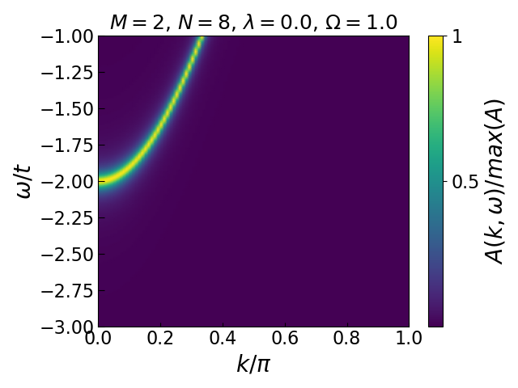
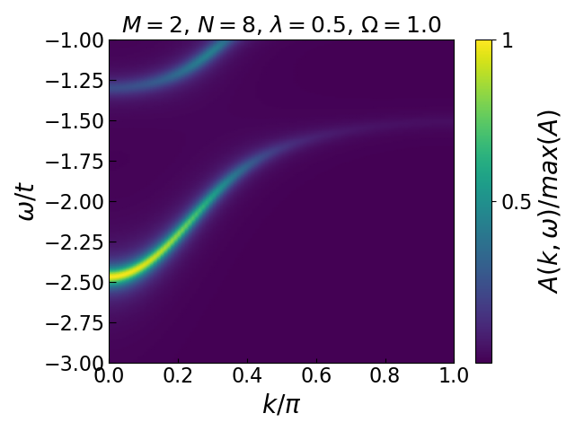

.. _petsc-intro:

========================================
GGCE-PETSc interface: introduction
========================================

In this tutorial, we show how to use GGCE's interface with PETSc for those
massively parallel calculations involving very large sparse matrices. We do this
on the example of calculating the spectral function near the polaron band in the Holstein
model.

What is PETSc?
--------------

The basic functionality of GGCE-PETSc is easily accessible once PETSc has been
installed following the instructions in the :ref:`install` section. As explained
in the install notes, PETSc is a purpose-built library for linear algebra that
allows MPI-parallel operations. This enables PETSc to tackle extremely large
matrices, the only limitation being the available resources.

The reason this is useful in GGCE is that for large enough cloud configurations,
and especially in higher dimensions (which will be available in future versions
of GGCE) and at finite temperature (see :ref:`finite-t`), applying the method
can result in large sparse matrices with dimensions in the hundreds of thousands or
even millions. Standard techniques for solving such systems, even threaded ones
like those available in SciPy, cannot handle such matrices due to memory and/or
time constraints.

PETSc comes equipped with methods for constructing MPI-shareable data structures
for matrices and solution vectors, as well as a great variety of "solvers"
(called *contexts*) for solving them. These solvers are able to make use of the
MPI-shared data layout to a) reduce memory load on any one process, and b) speed-up
the computation by exploiting known parallelization schemes.

How do we access PETSc in GGCE?
-------------------------------

PETSc has a Python API (``petsc4py``) that wraps most of PETSc's functionality for
convenient access in Python. The GGCE-PETSc interface is built using those wrappers.

Currently implemented is the `MUMPS <https://graal.ens-lyon.fr/MUMPS/index.php>`__
context of PETSc. MUMPS (Multifrontal Massively Parallel sparse direct Solver) is a
free, MPI-enabled, well-tested and reliable direct sparse matrix solver
often used in situations involving big matrices, such as in finite-element
modelling (FEM). MUMPS is available in GGCE as the ``MassSolverMUMPS`` Solver
object (through PETSc). The object implements all the same methods as a standard
GGCE Solver object, including a parallel-enabled ``.greens_function()``,
and can be used in exactly the same way as a parallel GGCE solver -- by passing in
the MPI communicator and executing the script with ``mpirun`` or ``mpiexec``.

After the simple import command

.. code-block:: python

  from ggce.executors.petsc4py import MassSolverMUMPS
  from mpi4py import MPI

we may use the usual GGCE syntax to set up a quick calculation

.. code-block:: python

  model = Model.from_parameters(hopping=1.)
  model.add_(
            "Holstein",
            phonon_frequency=1.,
            phonon_extent=2,
            phonon_number=8,
            dimensionless_coupling_strength=0.0
            )

  system = System(model)

  COMM = MPI.COMM_WORLD
  solver = MassSolverMUMPS(system=system, mpi_comm=COMM)

Polaron dispersion
------------------

Now for some physics. In the Holstein model with dimensionless coupling :math:`\lambda = g^2 / 2\Omega t`
and (Einstein) phonon frequency :math:`\Omega`, we expect the polaron band to be roughly
:math:`E_P(k=0) \approx -2t - \lambda`, and increase in energy away from :math:`k=0`.
Fixing :math:`\Omega = 1, \lambda = 0.5`, this implies we should investigate a
range of :math:`\omega \in [-3, -1]` to get a good view of the polaron band
across the Brillouin zone.

.. code-block:: python

  kgrid = np.linspace(0, np.pi, 100)
  wgrid = np.linspace(-3., -1., 200)

  COMM = MPI.COMM_WORLD
  solver = MassSolverMUMPS(system=system, mpi_comm=COMM)
  G = solver.greens_function(kgrid, wgrid, eta=0.05, pbar=True)

The result can be plotted with ``pcolormesh`` -- note that the ``G`` array of Green's
functions needs to be **transposed** to correspond to the "normal" alignment of
:math:`k,\omega`.

On the left we show the electronic band of the noninteracting system, for reference.
As we can see, adding a Holstein interaction term to the Hamiltonian results in the
lowering of the electron's energy (shifting of the band down), as well as changing its
hopping behaviour (dispersion).

Visually, you can tell that the band curvature around the
:math:`k=0` point is changed -- the band is flattened in that neighbourhood. A flattened
band means a higher effective mass and thus a "slower" electron. This makes sense: the cloud of phonons that
the electron is now forced to drag around is slowing it down, making it move as if through
molasses.

This concludes an introduction to the basic features of the GGCE-PETSc interface. To learn
more about some of the advanced features on offer, see :ref:`petsc-advanced`.
